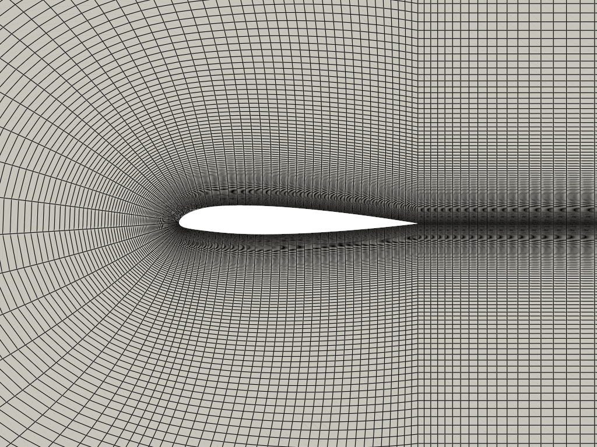
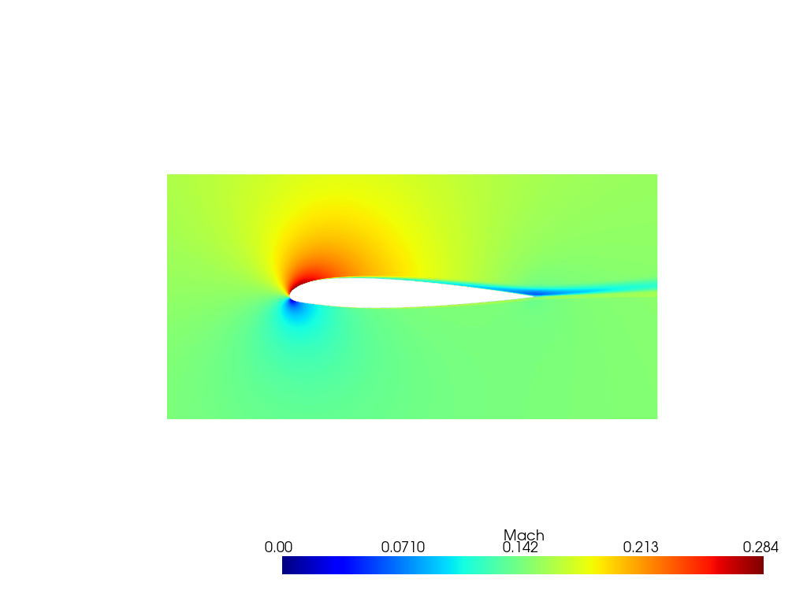

# MikFoil

MikFoil is a Python library designed to automate the repeatable phases of 2D airfoil Computational Fluid Dynamics (CFD). It provides full control over modeling decisions while remaining incredibly easy to use.




## Core Capabilities

- **Custom Mesher:** Generates structured, mapped meshes for any airfoil (using NACA number or `.dat` files) in seconds. Mesh parameters are fully tunable.
- **Simulation Automation:** Automates CFD simulation setup and orchestration using the SU2 solver.
- **Batch Processing:** Scales seamlessly for large automated batches, mesh independence studies, and validating CFD models against experimental data.
- **Postprocessing & Validation:** Automates the most common airfoil postprocessing tasks and provides tools for quick result validation.

## Prerequisites

MikFoil relies on the **SU2 CFD solver** for flowfield computations. **You must install SU2 to run simulations.**

* [SU2 Official Website](https://su2code.github.io/)
* [SU2 Download & Installation Guide](https://su2code.github.io/download.html)

Make sure the SU2 executable is in your system path, or set the `SU2_CFD_PATH` environment variable.

## Installation

```bash
pip install mikfoil
```

## Getting Started

A set of 11 Jupyter Notebook tutorials is included to guide you through using the library. You can also run a quick start case:

```python
from mikfoil.case import Case, MeshConfig
from mikfoil.main import execute_case

# Define physical boundary conditions and mesh parameters
case = Case(
    airfoil='naca_2412',
    aoa=2.0,
    mach=0.15,
    reynolds=1e6,
    mesh_config=MeshConfig(visualise=False),
    su2_config='default',
    target_y_plus=1.0,
    restart=False,
    suffix='example'
)

# Execute the full CFD pipeline: meshing, SU2 solver, and post-processing
execute_case(case)
```
